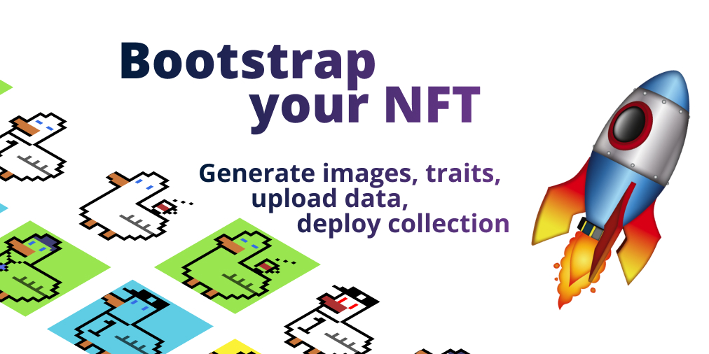
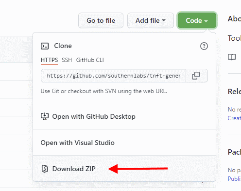
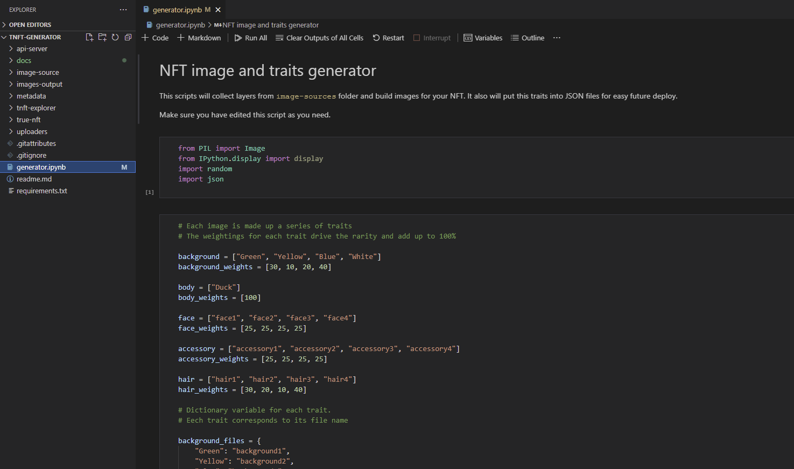

# Getting started for noobs 🧐



## 1. Installing software

Make sure you have installed required software:

- [VisualStudio Code](https://code.visualstudio.com/)
- [Latest Python](https://www.python.org/downloads/)
- [Latest Node.js](https://nodejs.org/en/download/)
- [Docker](https://www.docker.com/products/docker-desktop)

## 2. Get the code

Download this repository from GitHub and unpack it on your computer



## 3. Configure Node.js

> ⚠️ Here you will need some skills of working with terminal. If you are using Windows, you can use PowerShell. Just open it and navigate to a directory where you have unpacked project, like `cd C:\Dev\n\tnft-generator`

1. Install yarn packet manager:

Node.js comes with npm but in this project we using yarn, so lets install it: `npm install --global yarn`

2. Install [Everdev](https://github.com/tonlabs/everdev). 

It is a console utility which helps to run local blockchain. Type in console: `npm install -g everdev`

## 4. Configure Python

1. Install requirements:

`pip install -r requirements.txt`

## 5. Configure docker and local blockchain

1. Install Ever OS Startup Edition using everdev:

`everdev se start`

Make sure you have docker running! This command will download and install local blockchain.

After installation you can open http://localhost/ in your browser and you should see the network explorer.

## 6. Working with VS Code

This project includes jupyter notebook files (typically python scripts with nice workflow) which easy to run in VS code. You still can open them as you want.

Open VS code and click "File" > "Open Folder..." and then select folder with this project.

✅ Since this point you can follow your guide how to make and deploy collection. [Persistent approach guide](persistent-approach-guide.md) for example.

## 7. How to work with generator.ipynb ?

This script will help you to generate images and traits. To run it just click `Run All` button.



You should edit this script to add your traits and change their rarity.

__This code corresponds to trait names and rarity (in %):__

```python
background = ["Green", "Yellow", "Blue", "White"] 
background_weights = [30, 10, 20, 40]

body = ["Duck"] 
body_weights = [100]

face = ["face1", "face2", "face3", "face4"] 
face_weights = [25, 25, 25, 25]

accessory = ["accessory1", "accessory2", "accessory3", "accessory4"] 
accessory_weights = [25, 25, 25, 25]

hair = ["hair1", "hair2", "hair3", "hair4"] 
hair_weights = [30, 20, 10, 40]
```

You can name traits as you want.

Next lines of code corresponds to __names of files with this traits__:

```python
background_files = {
    "Green": "background1",
    "Yellow": "background2",
    "Blue": "background3",
    "White": "background4"
}

body_files = {
    "Duck": "body1",
}

face_files = {
    "face1": "face1",
    "face2": "face2",
    "face3": "face3",
    "face4": "face4",
}
```

You can add more traits, so you should add more files in `image-source` directory.

__For example, if you want to add a new background:__

1. Create file `background/background5.png`

2. Add this trait name and rarity:

```python 
background = ["Green", "Yellow", "Blue", "White", "Pink"] 
background_weights = [30, 10, 20, 30, 10]
```

3. Define this trait file:

```python 
background_files = {
    "Green": "background1",
    "Yellow": "background2",
    "Blue": "background3",
    "White": "background4",
    "Pink": "background5"
}
```

__How to generate more images?__

By default script is set up to make 32 NFTs. You can change it in next block in `generator.ipynb`

```python
TOTAL_IMAGES = 32 # Set here your number!
```

__How to change the size of images?__

By default script is set up to make 128x128 pixel images. You can find this line in the end of script:

```python
#Resize to 128x128 pixels
im_resized = com4.resize((128,128), Image.NEAREST)
```

You can delite this line and _images will not be resized_. Or you can edit dimesions to resize images as you want.

## What is next?

Now you know how to generate images and have ready to battle environment.

[Please follow one of the deployment guides ⏭️](../readme.md#-get-started )